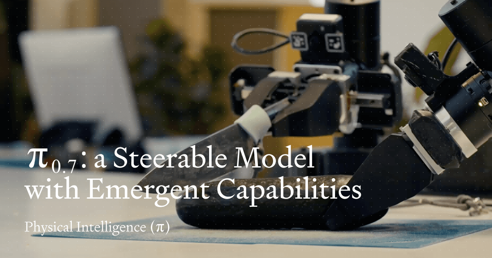
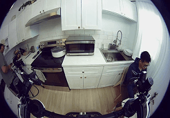
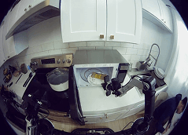
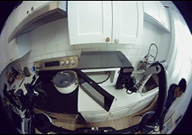
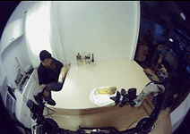

# π0.7: A Steerable Generalist Robotic Foundation Model with Emergent Capabilities

## 引用信息

| 字段 | 内容 |
|------|------|
| **论文标题** | π0.7: a Steerable Generalist Robotic Foundation Model with Emergent Capabilities |
| **机构** | Physical Intelligence (PI) |
| **论文链接** | https://pi.website/pi07 |
| **核心作者** | Bo Ai, Ali Amin, Chelsea Finn, Karol Hausman, Brian Ichter, Sergey Levine, Kevin Black 等 |
| **发布时间** | 2026年4月16日 |
| **模型规模** | ~5B 参数 (VLM backbone: 4B Gemma3, Action Expert: 860M) |



> **图片来源**：PI 官网 `https://www.pi.website/pi07` — 展示了 π0.7 在多种机器人平台上执行多样化任务的能力

---

## 一句话总结

**π0.7 通过多样化上下文条件化（Diverse Context Conditioning）策略，让单一通用机器人基础模型在无需任务特定微调的情况下，在灵巧操控、指令跟随、跨本体迁移和组合泛化等多个维度达到或接近专用 RL 微调模型的水平。**

---

## 核心贡献

1. **Diverse Context Conditioning（DCC）**：将提示从单一语言指令扩展为多模态上下文（语言子任务、策略元数据、子目标图像），使模型能从异构数据中学习而不产生平均化效应

2. **Episode Metadata 消歧机制**：用 Quality/Speed/Mistake 三元组实现对次优数据的可控利用，实现从 RL 专用策略到通用模型的"蒸馏"

3. **零样本跨本体迁移**：在灵巧任务（衬衫折叠）上，模型自主发现适应目标本体的操控策略，达到人类专家水平（80% vs 80.6% success rate）

4. **语言 Coaching 范式**：利用强大的指令跟随能力，通过口头 step-by-step 指导教会新任务，无需额外演示数据

5. **数据 scaling 规律**：有 Metadata 时数据越多（质量越低）性能越强；无 Metadata 时更多低质量数据反而有害

---

## 二、背景与问题动机

### 2.1 VLA 的成就与困境

视觉-语言-动作模型（VLA）在机器人操控任务上已取得显著进展，但面临两个核心瓶颈：

**（1）组合泛化能力不足**。语言模型可以灵活组合不同知识解决新问题，但 VLA 难以做到——不仅无法解决全新任务，甚至连训练数据中的任务都无法流畅执行。

**（2）任务特定微调的必要性**。当前最佳性能的策略往往需要针对下游任务进行 RL 微调（代表工作：π*₀.6），这意味着每个新任务都需要独立训练，失去了通用基础模型的意义。

### 2.2 核心洞察

π0.7 团队的核心洞察来自对"多样化数据"的重新理解：

**数据多样性本身不是问题，问题在于缺乏消歧信号。** 当训练数据中混杂了：
- 不同质量级别的演示（成功 / 失败 / 次优）
- 不同策略的执行方式（快 / 慢 / 精确 / 粗略）
- 不同来源的数据（机器人演示 / 人类视频 / 互联网图文）

如果直接混合训练，模型会在不同模式间"平均化"，导致性能下降。但如果为每个样本提供**丰富的上下文信息（Context）**，让模型知道"这条数据代表什么质量、什么策略"，就能让模型从异构数据中学习而不产生混乱。

这个思路在图像/视频生成领域已有应用（Prompt Expansion），π0.7 首次将其系统性地引入机器人 VLA 领域。

---

## 三、方法详解

### 3.1 整体架构

π0.7 基于 π0.6 的 VLA 架构，扩展了 MEM 记忆系统，模型约 **5B 参数**：

| 组件 | 规模 | 说明 |
|------|------|------|
| **VLM Backbone** | Gemma3 4B（含 400M Vision Encoder） | 初始化自预训练 Gemma3 |
| **MEM History Encoder** | — | 时序+空间压缩，将任意历史帧压缩至固定 token 数 |
| **Action Expert** | 860M Flow Matching Transformer | 连续动作预测，输出 50 步 action chunk |

**π0.7 整体架构图：**

```
┌─────────────────────────────────────────────────────────────────────────┐
│                          π0.7 Model (~5B Parameters)                     │
├─────────────────────────────────────────────────────────────────────────┤
│                                                                         │
│   ┌──────────────┐     ┌─────────────────────┐     ┌─────────────────┐ │
│   │  4×Camera    │     │  MEM History        │     │  本体感受       │ │
│   │  (Front +    │────▶│  Encoder            │     │ 状态 q_t        │ │
│   │   2×Wrist +   │     │  (时序+空间压缩)    │     │                 │ │
│   │   Rear)      │     └──────────┬──────────┘     └────────┬────────┘ │
│   └──────────────┘                │                           │         │
│                                   │                           │         │
│                                   ▼                           ▼         │
│                        ┌──────────────────────────────────────────────┐   │
│                        │           Gemma3 4B VLM Backbone            │   │
│                        │    (含 400M Vision Encoder + Language Model)│   │
│                        └──────────────────────────┬───────────────────┘   │
│                                                   │                       │
│                              ┌────────────────────┼────────────────────┐   │
│                              ▼                    ▼                    ▼   │
│                     ┌──────────────┐    ┌───────────────┐   ┌──────────┐ │
│                     │ Subtask ℓ̂_t │    │ Subgoal g_t   │   │ Metadata  │ │
│                     │ (语言子任务) │    │ (子目标图像)   │   │ m={S,Q,M} │ │
│                     └──────────────┘    └───────────────┘   └──────────┘ │
│                                             │                    │         │
│                                             │   ┌────────────────┘         │
│                                             │   │                          │
│                                             ▼   ▼                          │
│                                    ┌─────────────────────┐                │
│                                    │  Action Expert      │                │
│                                    │  860M Flow Matching  │                │
│                                    │  Transformer         │                │
│                                    │  输出 50-step chunk  │                │
│                                    └──────────┬──────────┘                │
│                                               │                            │
│                                               ▼                            │
│                                        a_{t:t+H}                          │
│                                      (动作序列)                           │
└─────────────────────────────────────────────────────────────────────────┘
```

**输入**：4 路相机图像（Front + 2×Wrist + 可选 Rear）、6 帧历史观察、本体感受状态 q_t

**Context C_t = {ℓ_t, ℓ̂_t, g_t, m, c}**：语言指令 + 子任务 + 子目标图像 + Episode 元数据 + 控制模式

### 3.2 标准 VLA 训练目标

标准 VLA 训练目标是最大化条件似然：

$$
\max_\theta \mathbb{E}_{\mathcal{D}} \left[ \log \pi_\theta(a_{t:t+H} \mid o_{t-T:t}, \mathcal{C}_t) \right]
$$

其中传统 Context 仅含语言指令 ℓ_t。π0.7 将 Context 扩展为多模态形式：

$$
\mathcal{C}_t = \{\ell_t,\ \hat{\ell}_t,\ g_t,\ m,\ c\}
$$

### 3.3 多模态 Context 详解

#### （1）Subtask Instructions（子任务指令）

除整体任务描述 ℓ_t（如 "clean the kitchen"），加入中间层语义子任务 $\hat{\ell}_t$（如 "open the fridge door"）。在推理时由高层策略或人类动态生成，实现 step-by-step Verbal Coaching。

#### （2）Subgoal Images（子目标图像）

语言难以描述的视觉细节（如机械臂抓取把手的角度），由**未来帧图像**提供视觉化目标。推理时由轻量级世界模型生成：

$$
\max_\psi \mathbb{E}_{\mathcal{D}_g} \left[ \mathcal{L}_{\text{CFM}}(g^*_t, g_\psi(o_t, \hat{\ell}_t, m)) \right]
$$

世界模型从 **BAGEL**（14B 图文生成模型）初始化，以异步方式每 Δ=4 秒或语义意图变化时重新生成。

#### （3）Episode Metadata（Episode 元数据）

用于消歧异构数据质量的**策略标签**：

| 元数据字段 | 含义 | 作用 |
|-----------|------|------|
| **Overall Speed** | Episode 长度（500 步为区间离散化） | 关联速度与质量 |
| **Overall Quality** | 任务执行质量分（1-5，5 最高） | 指示最优行为 |
| **Mistake** | 是否在 segment 内犯错 | 过滤失败案例 |

训练时随机 dropout 各部分上下文（子目标图像 25%、子任务指令 30%、Episode 元数据 15%），使模型可灵活使用任意子集的提示。

#### （4）Control Mode（控制模式）

文本标识 $c \in \{\text{joint}, \text{ee}\}$ 区分关节空间与末端执行器空间控制。

### 3.4 完整提示示例

```
<多视角观察><多视角子目标>
Task: peel vegetables. 
Subtask: pick up the peeler. 
Speed: 8000. 
Quality: 5. 
Mistake: false. 
Control Mode: joint.
<本体感受>
```

### 3.5 训练数据

π0.7 训练数据构成极为多样：
1. **演示数据**：多机器人平台（静态/移动、单臂/双臂）、多种环境
2. **自主数据**：策略评估的 rollout、RL 后训练模型的数据（含失败案例）
3. **人类 egocentric 视频数据**
4. **互联网多模态数据**：目标定位、VQA、图文任务
5. **开源机器人数据集**（Open X-Embodiment 等）

**关键创新**：重度使用次优数据。通过 Episode Metadata 消歧，模型可从失败中学习而不损害最终性能——相当于将 RL 专用策略的技能"蒸馏"到通用模型。

### 3.6 推理流程（Algorithm 1）

```
输入: 初始观察 o0, 任务指令 ℓ, Episode 元数据 m, 控制模式 c
1: 初始化子任务 ˆℓ（来自高层策略或人类 coaching）
2: g* ~ p_ψ(g* | o0, ˆℓ, m)
3: C = {ℓ, ˆℓ, g*, m, c}
4: a_{t:t+H} ~ π_θ(a | o_{t-T:t}, C)     ▷ 可选 CFG
5: for t = 0, 1, 2, ... do
6:     if ˆℓ 变化 or Δ 秒计时器到期 then
7:         g* ~ p_ψ(g* | o_t, ˆℓ, m)   ▷ 非阻塞异步
8:         C = {ℓ, ˆℓ, g*, m, c}
9:     end if
10:    if ˆH 步已执行 then
11:        a_{t:t+H} ~ π_θ(a | o_{t-T:t}, C, a_{t-ˆH:})  ▷ RTC 异步
12:    end if
13:    执行 a_t
14: end for
```

### 3.7 Classifier-Free Guidance（CFG）

通过 CFG 增强动作质量，主要应用于 Episode Metadata 以激发灵巧任务的高性能：

CFG 权重 β ∈ {1.3, 1.7, 2.2}

---

## 四、实验结果

### 4.1 开箱即用灵巧操控（§IX-A）

π0.7 在无需任何任务特定微调的情况下，在多种复杂灵巧任务上匹配或超过专用 RL 微调模型：

| 任务 | π0.7 vs π*₀.6 RL Specialist | 结论 |
|------|---------------------------|------|
| Laundry (T-Shirts & Shorts) | 更高吞吐量 | **超越** |
| Laundry (Diverse - Hardest) | 更高吞吐量 | **超越** |
| Make Espresso | 相当 | **持平** |
| Box Building | 更高吞吐量 | **超越** |
| Make PB Sandwich / Slice Zucchini / Peel Fruits / Take Out Trash | 相当 | **持平** |

**消融实验**：移除 Episode Metadata 或移除评估数据均导致显著性能下降，证明两者对复杂灵巧任务至关重要。

### 4.2 指令跟随能力（§IX-B）

在 4 个未见的厨房和 2 个未见的卧室环境中，π0.7 对 3-6 步指令序列的跟随成功率显著超越 π0.5 和 π0.6。

**打破数据偏见**：在"Reverse Bussing"和"Reverse Fridge to Microwave"等违背训练数据分布的任务中，π0.7 仍能正确跟随指令。

### 4.3 跨本体迁移（§IX-C + Appendix F）

<div style="display: flex; gap: 8px;">
  
  
</div>

> **上图**：π0.7 从小型静态双臂机器人（source）迁移到大型 UR5e 双臂机器人（target），进行衬衫折叠任务——源机器人和目标机器人在体型、臂形、工作空间上差异显著

**最引人注目的结果**：在衬衫折叠任务上，零样本迁移到 UR5e：

| 对比 | Task Progress | Success Rate |
|------|:-----------:|:-----------:|
| **π0.7 (GC)** | 85.6% | 80% |
| **人类专家 teleoperator** | 90.9% | 80.6% |

模型并非复制源机器人策略，而是**自适应发现新策略**：
- 源机器人用双臂配合开袋，UR5e 改用单臂 pick-and-place
- 源机器人倾斜末端执行器，UR5e 改用垂直抓取（更适合其臂形）

### 4.4 组合任务泛化（§IX-D）

<div style="display: flex; gap: 8px;">
  
  
</div>

> **左图**：π0.7 通过人类 step-by-step 口头指令（Coaching）学习新任务；**右图**：世界模型生成的子目标图像（Subgoal Image），为策略提供视觉化的目标状态

**语言 Coaching 范式**：π0.7 可通过人类口头指令 step-by-step 指导来学习新任务（如用空气炸锅烹饪）。Coaching 数据进一步训练高层语言策略，实现完全自主执行，5 个新长周期任务验证了此路径的有效性。

### 4.5 数据规模与多样性缩放（§IX-E）

- **有 Metadata 的 π0.7**：随数据集增大（即使平均质量下降）性能持续提升
- **无 Metadata 的 π0.7**：加入更多低质量数据后性能反而下降
- 移除最高任务多样性的 20% 数据会导致性能显著下降

---

## 五、附录：π0.7 论文全文精读总结

### §A.1 论文信息与研究背景

π0.7 是 Physical Intelligence 于 2026 年 4 月 16 日发布的机器人基础模型，延续了 π0 系列（π0 → π0.5 → π0.6 → π*₀.6 → π0.7）的迭代路径。

**研究问题**：现有 VLA 虽在规模和数据上不断扩展，但组合泛化能力始终不足——既无法解决全新任务，也难以流畅执行训练数据中的任务（往往需要任务特定微调）。核心瓶颈是：学习的是"动作轨迹"而非"行为策略"，缺乏对多样化数据中不同质量/策略的消歧能力。

### §A.2 核心贡献总结

1. **多样化上下文条件化（Diverse Context Conditioning）**：将提示从单一语言指令扩展为多模态上下文（语言子任务、策略元数据、子目标图像），使模型能从异构数据中学习而不产生平均化效应

2. **Episode Metadata 作为策略条件化信号**：用质量/速度/错误标签消歧次优数据，实现从 RL 专用策略到通用模型的"蒸馏"

3. **零样本跨本体迁移**：在灵巧任务（衬衫折叠）上，模型自主发现适应目标本体的操控策略，达到人类专家水平

4. **语言 Coaching 范式**：利用强大的指令跟随能力，通过口头 step-by-step 指导教会新任务，无需额外演示数据

### §A.3 关键技术细节

**架构**：Gemma3 4B VLM backbone + MEM History Encoder + 860M Flow Matching Action Expert，~5B 总参数

**Context = $\{\ell_t, \hat{\ell}_t, g_t, m, c\}$**：
- ℓ_t：整体任务语言描述
- $\hat{\ell}_t$：中间层语义子任务（来自高层策略或人类 coaching）
- g_t：子目标图像（由 BAGEL 初始化的世界模型生成）
- m = {Speed, Quality, Mistake}：Episode 元数据
- c ∈ {joint, ee}：控制模式

**训练数据 dropout**：子目标图像 25%、子任务指令 30%、Episode 元数据 15%

**推理**：异步执行（VLA 执行与子目标生成并行），CFG 权重 β ∈ {1.3, 1.7, 2.2}，50 步 action chunk

### §A.4 实验发现与洞察

| 实验 | 核心发现 |
|------|----------|
| Out-of-box Dexterity | π0.7 在 Laundry/Espresso/Box Building 等任务上匹配或超越 RL Specialist，且吞吐量更高 |
| Instruction Following | 在全新厨房/卧室环境中 3-6 步指令跟随成功率显著超越 π0.5/π0.6 |
| Cross-Embodiment | 衬衫折叠零样本迁移到 UR5e 达到人类专家水平（80% vs 80.6%），模型自适应发现新策略而非复制 |
| Coaching | 口头 step-by-step 指令可教会新任务，Coaching 数据可训练高层策略实现完全自主 |
| Data Scaling | 有 Metadata 时数据越多（质量越低）性能越强；无 Metadata 时更多低质量数据反而有害 |

### §A.5 推理优化（Appendix D）

- 单 GPU H100：最小配置 38ms，启用 MEM + 子目标图像时 127ms
- 子目标图像生成：4×H100 张量并行 + 8-bit 量化 + SageAttention，25 步去噪 1.25 秒

### §A.6 人类受试者研究（Appendix F）

- 招募 10 名 top 2% 操作员（平均 375 小时经验），从未来 UR5e 上进行衬衫折叠
- 与 π0.7 相同零样本设置：结果人类 90.9% task progress / 80.6% success rate；π0.7 (GC) 85.6% / 80%

---

## 六、KnowHow + 总结评价

### 6.1 核心贡献

1. **Diverse Context Conditioning**：将"如何做"的策略信息从数据中分离，使同一数据可教模型多种策略，测试时通过上下文选择策略——本质上是将 System Prompt 思想引入机器人控制
2. **Episode Metadata 消歧机制**：用 Quality/Speed/Mistake 三元组实现对次优数据的可控利用，为 RL 蒸馏到通用模型提供了可扩展的路径
3. **跨本体迁移达到人类专家水平**：证明了"意图"（低频策略）比"执行"（高频细节）更具跨本体迁移性
4. **Coaching 范式**：用自然语言教会机器人新任务，而非每次都收集演示数据，打开了新任务获取的可能性

### 6.2 局限性

- 零样本泛化成功率（60-80%）仍低于分布内任务（>90%）
- 子目标图像生成依赖 14B 世界模型，计算成本较高
- 真实世界泛化能力难以精确衡量（数据集中可能已包含相关技能）

### 6.3 个人点评

π0.7 最值得关注的 insight 是：**多样化的上下文提示本质上是把"数据消歧"的工作从数据预处理阶段转移到了模型输入层面**。传统方法需要人工筛选/过滤数据质量，而 π0.7 让模型自己学会根据上下文判断"这条数据代表什么质量，应该怎么用"。

这一思想与语言模型中的 Prompt Engineering 一脉相承——不是改变模型参数，而是改变输入的提示形式来操纵模型行为。π0.7 在机器人领域首次系统性地验证了这一路径的可行性。

对于未来最有启发的方向：**Coaching 范式**。如果模型可以通过自然语言学会新任务，那么未来或许可以让机器人通过"看说明书"来执行新操作，而非每次都需要人类演示。

---

## 参考链接

- **论文主页**：https://pi.website/pi07
- **Physical Intelligence**：https://physicalintelligence.com

---

*整理 by 优酱 🍃 | 2026-04-17*
*精读标准参考 MEMORY.md § 论文精读格式标准*
