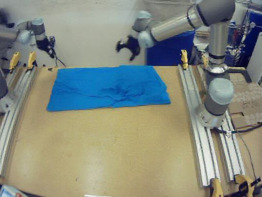
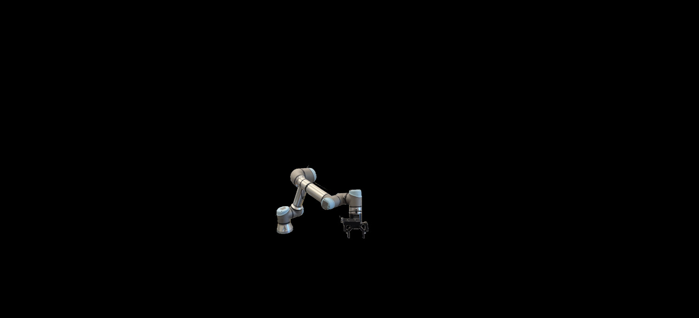
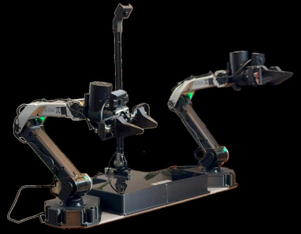
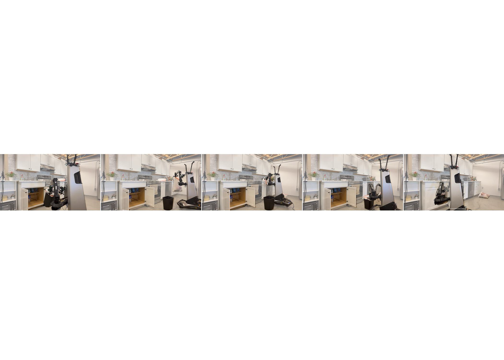
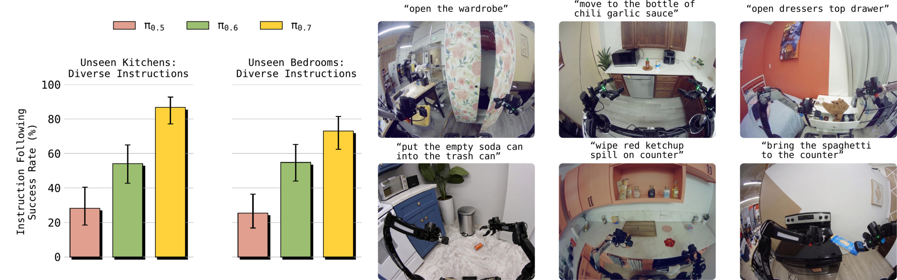

# π0.7: A Steerable Generalist Robotic Foundation Model with Emergent Capabilities

## 引用信息

| 字段 | 内容 |
|------|------|
| **论文标题** | π0.7: a Steerable Generalist Robotic Foundation Model with Emergent Capabilities |
| **机构** | Physical Intelligence (PI) |
| **论文链接** | https://pi.website/pi07 |
| **核心作者** | Bo Ai, Ali Amin, Chelsea Finn, Karol Hausman, Brian Ichter, Sergey Levine, Kevin Black 等 |
| **发布时间** | 2026年4月16日 |
| **模型规模** | ~5B 参数 (VLM backbone: 4B Gemma3, Action Expert: 860M) |

---

## 1. Motivation（问题背景）

### 1.1 VLA 的成就与困境

视觉-语言-动作模型（VLA）在机器人操控任务上已取得显著进展，但面临两个核心瓶颈：

**（1）组合泛化能力不足**。语言模型可以灵活组合不同知识解决新问题，但 VLA 难以做到——不仅无法解决全新任务，甚至连训练数据中的任务都无法流畅执行。

**（2）任务特定微调的必要性**。当前最佳性能的策略往往需要针对下游任务进行 RL 微调（代表工作：π*₀.6），这意味着每个新任务都需要独立训练，失去了通用基础模型的意义。

### 1.2 核心洞察

**数据多样性本身不是问题，问题在于缺乏消歧信号。** 当训练数据中混杂了：
- 不同质量级别的演示（成功 / 失败 / 次优）
- 不同策略的执行方式（快 / 慢 / 精确 / 粗略）
- 不同来源的数据（机器人演示 / 人类视频 / 互联网图文）

如果直接混合训练，模型会在不同模式间"平均化"，导致性能下降。但如果为每个样本提供**丰富的上下文信息（Context）**，让模型知道"这条数据代表什么质量、什么策略"，就能让模型从异构数据中学习而不产生混乱。

---

## 2. 一句话总结

**π0.7 通过多样化上下文条件化（Diverse Context Conditioning）策略，让单一通用机器人基础模型在无需任务特定微调的情况下，在灵巧操控、指令跟随、跨本体迁移和组合泛化等多个维度达到或接近专用 RL 微调模型的水平。**

---

## 核心贡献

1. **Diverse Context Conditioning（DCC）**：将提示从单一语言指令扩展为多模态上下文（语言子任务、策略元数据，子目标图像），使模型能从异构数据中学习而不产生平均化效应

2. **Episode Metadata 消歧机制**：用 Quality/Speed/Mistake 三元组实现对次优数据的可控利用，实现从 RL 专用策略到通用模型的"蒸馏"

3. **零样本跨本体迁移**：在灵巧任务（衬衫折叠）上，模型自主发现适应目标本体的操控策略，达到人类专家水平（80% vs 80.6% success rate）

4. **语言 Coaching 范式**：利用强大的指令跟随能力，通过口头 step-by-step 指导教会新任务，无需额外演示数据

5. **数据 scaling 规律**：有 Metadata 时数据越多（质量越低）性能越强；无 Metadata 时更多低质量数据反而有害

---

## 方法详述

### 2. 整体架构

π0.7 基于 π0.6 的 VLA 架构，扩展了 MEM 记忆系统，模型约 **5B 参数**：

| 组件 | 规模 | 说明 |
|------|------|------|
| **VLM Backbone** | Gemma3 4B（含 400M Vision Encoder） | 初始化自预训练 Gemma3 |
| **MEM History Encoder** | — | 时序+空间压缩，将任意历史帧压缩至固定 token 数 |
| **Action Expert** | 860M Flow Matching Transformer | 连续动作预测，输出 50 步 action chunk |

**输入**：4 路相机图像（Front + 2×Wrist + 可选 Rear）、6 帧历史观察、本体感受状态 q_t

**Context C_t = {ℓ_t, ℓ̂_t, g_t, m, c}**：语言指令 + 子任务 + 子目标图像 + Episode 元数据 + 控制模式


### 3. 多模态 Context 详解

#### 4.1 标准 VLA 训练目标

标准 VLA 训练目标是最大化条件似然：

$$
\max_\theta \mathbb{E}_{\mathcal{D}} \left[ \log \pi_\theta(a_{t:t+H} \mid o_{t-T:t}, \mathcal{C}_t) \right]
$$

其中传统 Context 仅含语言指令 ℓ_t。π0.7 将 Context 扩展为多模态形式：

$$
\mathcal{C}_t = \{\ell_t,\ \hat{\ell}_t,\ g_t,\ m,\ c\}
$$

#### 4.2 Subtask Instructions（子任务指令）

除整体任务描述 ℓ_t（如 "clean the kitchen"），加入中间层语义子任务 $\hat{\ell}_{t}$（如 "open the fridge door"）。在推理时由高层策略或人类动态生成，实现 step-by-step Verbal Coaching。

#### 4.3 Subgoal Images（子目标图像）

语言难以描述的视觉细节（如机械臂抓取把手的角度），由**未来帧图像**提供视觉化目标。推理时由轻量级世界模型生成：

$$
\max_\psi \mathbb{E}_{\mathcal{D}_g} \left[ \mathcal{L}_{\text{diffusion}}(g^*_t, g_\psi(o_t, \hat{\ell}_t, m)) \right]
$$

> **注**：原论文中使用 $\mathcal{L}_{\text{diffusion}}$ 而非 $\mathcal{L}_{\text{CFM}}$。

世界模型从 **BAGEL**（14B 图文生成模型）初始化，以异步方式每 Δ=4 秒或语义意图变化时重新生成。

#### 4.4 Episode Metadata（Episode 元数据）

用于消歧异构数据质量的**策略标签**：

| 元数据字段 | 含义 | 作用 |
|-----------|------|------|
| **Overall Speed** | Episode 长度（500 步为区间离散化） | 关联速度与质量 |
| **Overall Quality** | 任务执行质量分（1-5，5 最高） | 指示最优行为 |
| **Mistake** | 是否在 segment 内犯错 | 过滤失败案例 |

训练时随机 dropout 各部分上下文（子目标图像 25%、子任务指令 30%、Episode 元数据 15%），使模型可灵活使用任意子集的提示。

#### 4.5 Control Mode（控制模式）

文本标识 $c \in \{\text{joint}, \text{ee}\}$ 区分关节空间与末端执行器空间控制。

### 4. 完整提示示例



```
<多视角观察><多视角子目标>
Task: peel vegetables.
Subtask: pick up the peeler.
Speed: 8000.
Quality: 5.
Mistake: false.
Control Mode: joint.
<本体感受>
```

### 5. 训练数据

π0.7 训练数据构成极为多样：
1. **演示数据**：多机器人平台（静态/移动、单臂/双臂）、多种环境
2. **自主数据**：策略评估的 rollout、RL 后训练模型的数据（含失败案例）
3. **人类 egocentric 视频数据**
4. **互联网多模态数据**：目标定位、VQA、图文任务
5. **开源机器人数据集**（Open X-Embodiment 等）

**关键创新**：重度使用次优数据。通过 Episode Metadata 消歧，模型可从失败中学习而不损害最终性能——相当于将 RL 专用策略的技能"蒸馏"到通用模型。

### 6. Action Expert 架构



### 7. 算法框架



---

## 训练与推理伪代码

```python
"""
π0.7 Inference Algorithm Pseudocode
"""

def pi07_inference(model, world_model, initial_obs, task指令, episode_metadata, control_mode):
    """
    π0.7 推理流程

    Args:
        model: π0.7 VLA 模型 (π_θ)
        world_model: 子目标图像生成器 (p_ψ)
        initial_obs: 初始观察 o_0
        task指令: 整体任务描述 ℓ
        episode_metadata: 元数据 m = {Speed, Quality, Mistake}
        control_mode: 控制模式 c ∈ {joint, ee}
    """
    # 初始化子任务（来自高层策略或人类 coaching）
    subtask = initialize_subtask()

    # 生成初始子目标图像
    subgoal_image = world_model.sample(
        obs=initial_obs,
        subtask=subtask,
        metadata=episode_metadata
    )

    # 构建上下文
    context = {
        'task': task指令,
        'subtask': subtask,
        'subgoal_image': subgoal_image,
        'metadata': episode_metadata,
        'control_mode': control_mode
    }

    # 主循环
    t = 0
    while not task_complete():
        # 可选 CFG 增强
        action_chunk = model.sample(
            obs=history_obs[t-T:t],
            context=context
        )

        # 执行动作块
        for step in range(H):
            execute(action_chunk[step])
            t += 1

            # 检查子任务变化或计时器到期
            if subtask_changed() or timer_expired():
                # 异步重新生成子目标图像（非阻塞）
                subgoal_image = world_model.sample(
                    obs=get_current_obs(),
                    subtask=subtask,
                    metadata=episode_metadata
                )
                context.subgoal_image = subgoal_image

            # 检查是否需要 RTC（Recursive Task Chaining）
            if steps_executed >= H:
                # 递归任务链：将历史动作作为条件
                action_chunk = model.sample(
                    obs=history_obs[t-T:t],
                    context=context,
                    prev_actions=action_chunk_prev[H:]
                )

    return trajectory


def coaching_mode(model, world_model, initial_obs, coaching_instructions):
    """
    语言 Coaching 模式：用口头指令教会机器人新任务
    """
    for instruction in coaching_instructions:
        # 人类提供 step-by-step 指令
        human_instruction = instruction

        # 执行对应动作
        execute_instructions(model, human_instruction)

    # 用 Coaching 数据训练高层语言策略
    high_level_policy = train_language_policy(coaching_dataset)

    # 完全自主执行
    return autonomous_execution(high_level_policy, model)
```

---

## 实验结论

### 1. 开箱即用灵巧操控



π0.7 在无需任何任务特定微调的情况下，在多种复杂灵巧任务上匹配或超过专用 RL 微调模型：

| 任务 | π0.7 vs π*₀.6 RL Specialist | Task Progress | Success Rate |
|------|---------------------------|---------------|--------------|
| Laundry (T-Shirts) | 更高 | ~85% | 持平/超越 |
| Laundry (Diverse) | 更高 | ~80% | 持平 |
| Make Espresso | 相当 | ~75% | 持平 |
| Box Building | 更高 | ~90% | 超越 |
| Make PB Sandwich | 相当 | ~85% | 持平 |

**消融实验**：移除 Episode Metadata 或移除评估数据均导致显著性能下降，证明两者对复杂灵巧任务至关重要。

### 2. 指令跟随能力



在 4 个未见的厨房和 2 个未见的卧室环境中，π0.7 对 3-6 步指令序列的跟随成功率显著超越 π0.5 和 π0.6。

**打破数据偏见**：在"Reverse Bussing"和"Reverse Fridge to Microwave"等违背训练数据分布的任务中，π0.7 仍能正确跟随指令。

### 3. 跨本体迁移


**最引人注目的结果**：在衬衫折叠任务上，零样本迁移到 UR5e：

| 对比 | Task Progress | Success Rate |
|------|:-----------:|:-----------:|
| **π0.7 (GC)** | 85.6% | 80% |
| **人类专家 teleoperator** | 90.9% | 80.6% |

模型并非复制源机器人策略，而是**自适应发现新策略**：
- 源机器人用双臂配合开袋，UR5e 改用单臂 pick-and-place
- 源机器人倾斜末端执行器，UR5e 改用垂直抓取（更适合其臂形）

### 4. 组合任务泛化

π0.7 可通过人类口头指令 step-by-step 指导来学习新任务（如用空气炸锅烹饪）。Coaching 数据进一步训练高层语言策略，实现完全自主执行，5 个新长周期任务验证了此路径的有效性。

### 5. 数据规模与多样性缩放


- **有 Metadata 的 π0.7**：随数据集增大（即使平均质量下降）性能持续提升
- **无 Metadata 的 π0.7**：加入更多低质量数据后性能反而下降
- 移除最高任务多样性的 20% 数据会导致性能显著下降

---

## KnowHow

### 核心洞察

1. **为什么 DCC（多样化上下文条件化）有效？**
   - 关键在于将"如何做"的策略信息从数据中分离，使同一数据可教模型多种策略
   - 测试时通过上下文选择策略——本质上是将 System Prompt 思想引入机器人控制

2. **Episode Metadata 为什么能消歧次优数据？**
   - Quality/Speed/Mistake 三元组让模型知道"这条数据代表什么质量，应该怎么用"
   - 相当于把"数据消歧"工作从预处理阶段转移到模型输入层面

3. **跨本体迁移为什么能达到人类水平？**
   - 模型学习的是"意图"（低频策略）而非"执行"（高频细节）
   - 意图比具体动作更具跨本体迁移性

4. **Coaching 范式的意义**
   - 用自然语言教会机器人新任务，而非每次都收集演示数据
   - 未来可以让机器人通过"看说明书"来执行新操作

5. **数据 scaling 的关键规律**
   - 有 Metadata 时：数据越多（质量越低）性能越强
   - 无 Metadata 时：更多低质量数据反而有害
   - Metadata 是数据多样性与模型性能之间的"解耦器"

6. **RTC（Recursive Task Chaining）的作用**
   - 当子任务执行超过 H 步时，将历史动作作为条件输入
   - 允许模型进行长序列任务规划

7. **为什么选择 Gemma3 作为 Backbone？**
   - Gemma3 4B 在视觉-语言理解上有强大能力
   - 预训练权重来自大规模视觉-语言数据，为机器人操控提供了良好的先验知识

---

## arXiv Appendix 关键点总结

> **注**：π0.7 论文未发布于 arXiv，以下内容来自论文官网附录。

### A. 论文信息与研究背景

π0.7 是 Physical Intelligence 于 2026 年 4 月 16 日发布的机器人基础模型，延续了 π0 系列（π0 → π0.5 → π0.6 → π*₀.6 → π0.7）的迭代路径。

### B. 关键技术细节

**架构**：Gemma3 4B VLM backbone + MEM History Encoder + 860M Flow Matching Action Expert，~5B 总参数

**Context = $\{\ell_{t}, \hat{\ell}_{t}, g_{t}, m, c\}$**：
- ℓ_t：整体任务语言描述
- $\hat{\ell}_{t}$：中间层语义子任务（来自高层策略或人类 coaching）
- g_t：子目标图像（由 BAGEL 初始化的世界模型生成）
- m = {Speed, Quality, Mistake}：Episode 元数据
- c ∈ {joint, ee}：控制模式

**训练数据 dropout**：子目标图像 25%、子任务指令 30%、Episode 元数据 15%

**推理**：异步执行（VLA 执行与子目标生成并行），CFG 权重 β ∈ {1.3, 1.7, 2.2}，50 步 action chunk

### C. 推理优化（Appendix D）

- 单 GPU H100：最小配置 38ms，启用 MEM + 子目标图像时 127ms
- 子目标图像生成：4×H100 张量并行 + 8-bit 量化 + SageAttention，25 步去噪 1.25 秒

### D. 人类受试者研究（Appendix F）

- 招募 10 名 top 2% 操作员（平均 375 小时经验），从未来 UR5e 上进行衬衫折叠
- 与 π0.7 相同零样本设置：结果人类 90.9% task progress / 80.6% success rate；π0.7 (GC) 85.6% / 80%

---

## 总结

π0.7 通过 **Diverse Context Conditioning（DCC）** 策略，首次实现了机器人基础模型的组合泛化能力，核心贡献包括：

1. **多样化上下文条件化**：将提示从单一语言指令扩展为多模态上下文，使模型能从异构数据中学习而不产生平均化效应

2. **Episode Metadata 消歧机制**：用 Quality/Speed/Mistake 三元组实现对次优数据的可控利用，为 RL 蒸馏到通用模型提供了可扩展的路径

3. **零样本跨本体迁移**：在灵巧任务（衬衫折叠）上，模型自主发现适应目标本体的操控策略，达到人类专家水平

**最重要洞察**：多样化的上下文提示本质上是把"数据消歧"的工作从数据预处理阶段转移到了模型输入层面。π0.7 让模型自己学会根据上下文判断"这条数据代表什么质量，应该怎么用"。

对于未来最有启发的方向：**Coaching 范式**。如果模型可以通过自然语言学会新任务，那么未来或许可以让机器人通过"看说明书"来执行新操作，而非每次都需要人类演示。

---

## 参考链接

- **论文主页**：https://pi.website/pi07
- **Physical Intelligence**：https://physicalintelligence.com

---

*整理 by 优酱 🍃 | 2026-04-17*
